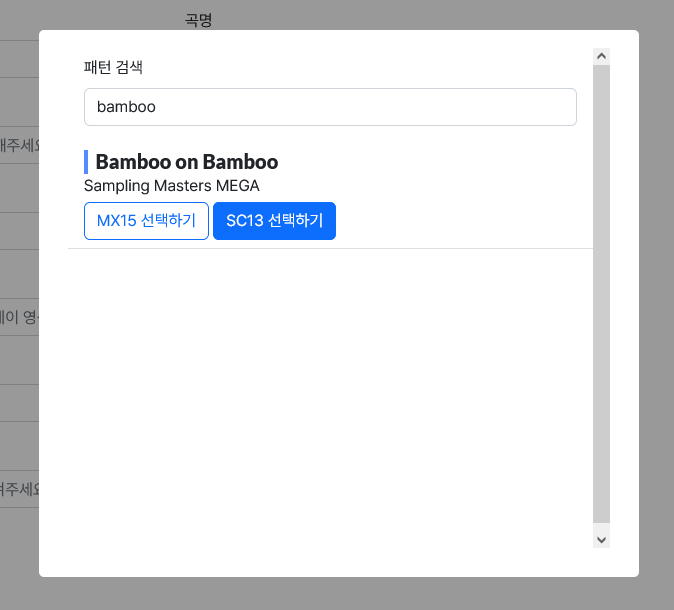

# 2023-09-17

1.  버튼 페이지에서 닉네임이 표시됩니다.

    .png>)

2.  파일 업로드 기능이 추가되었습니다.

    .png>)

    -   클립보드에 이미지가 있는 경우 붙여넣기를 이용해 파일을 선택할 수 있습니다.
    -   기존 방식과 동일하게 링크로 업로드 하셔도 상관 없습니다.
    -   파일 업로드시 업로드된 파일의 링크가 자동으로 들어갑니다. (`https://hard-archive.com/file/view/< ID >.webp`)

3.  일부 버그가 수정되었습니다.
4.  이펙터 사용 통계 페이지가 추가되었습니다.
5.  최근 승인 기록가 추가되었습니다.
6.  승인 거절 목록가 추가되었습니다.

# 2023-09-18

1.  등록된 기록 개수를 통해 버튼 비율이 표시됩니다.

    .png>)

2.  사용자가 선택한 이펙터 정보가 그래프를 통해 표시됩니다.

    .png>)

3.  난이도별 판정 그래프가 프로필에 표시됩니다.

    .png>)

4.  프로필 **BEST 30**이 점수 기준에서 환산 점수 기준으로 변경됩니다. (작게 표시된 점수가 환산 점수입니다.)

    .png>)

5.  프로필과 자신의 기록의 경우 링크 미리보기 아이콘이 본인의 프로필 사진(디스코드)로 표시됩니다.
6.  일부 버그가 수정되었습니다. (프로필 관련, 그래프 관련, 내부처리 관련)

# 2023-09-19

1.  버튼별 페이지에서 판정 모드를 선택할 수 있습니다.

    .png>)

2.  내 기록만 나오는 버튼별 페이지가 추가되었습니다. (타인의 버튼별 페이지도 확인할 수 있습니다.)

    .png>)

    \- 프로필 닉네임 하단의 '버튼별 기록 모아보기' 버튼

    \- 프로필 퍼펙트 표의 색칠된버튼

    \- (로그인 시) 좌측 메뉴의 '내 버튼별 기록' 메뉴

3.  버튼별 페이지에서 ㄱㄴㄷ순이 아닌 난이도 순으로 정렬 순서가 변경되었습니다.
4.  일부 곡의 정보가 잘못 설정된 문제가 수정되었습니다.
5.  검색어의 최대 길이가 30자로 조정되었습니다.
6.  일부 곡에 별칭(한국어 발음 등)을 추가했습니다. 악곡 검색에 활용됩니다.
7.  버튼별 페이지에서 난이도를 전체로 선택시 기록을 확인할 수 없는 버그를 수정했습니다.
8.  파일 업로드시 해당 파일의 마지막 수정 시간을 자동 선택해주도록 수정했습니다.

# 2023-09-20

1. 파일 업로드시 발생하는 자동 시간 입력 문제가 해결되었습니다.
2. 프로필 표시 관련된 내부 처리 로직이 수정되었습니다.
3. 규칙 페이지가 해당 문서 사이트로 이동했습니다.
4. 비공개 그래프 설정이 추가되었습니다.

    .png>).png>)

    - 다음과 같이 프로필에서 숨길 그래프를 선택할 수 있습니다.
    - 숨겨진 그래프는 프로필에서 확인할 수 없습니다. (본인 포함)

5. 일부 악곡의 검색용별명이 추가되었습니다.
6. 일부 악곡의 아카이브(노래 듣기) 정보가 설정되었습니다.

# 2023-09-21

1. 기록 등록/수정 페이지의 UI가 사소하게 변경되었습니다. (모바일 및 소형 화면의 크기 조정)
2. 악곡 선택 팝업창에 검색 기능이 추가되었습니다.

    .png>)

3. 난이도 선택창에 전체 옵션이 추가되었습니다.

    .png>)

    - 난이도를 전체로 선택하고 곡을 선택화면으로 넘어가면 여러 난이도가 같이 표시됩니다.
    - 이때 MX 난이도는 배경이 흰색으로 표시됩니다.

4. 게임과 다르게 설정된 팩 이름이 수정되었습니다.
5. 일부 버그가 수정되었습니다.

# 2023-09-22

1. 파일에서 시간 정보를 가져올 때 확인하도록 수정했습니다.
2. 업로드한 파일 정보를 저장할 때 앞뒤 빈공간을 자르도록 수정했습니다.
3. 곡 선택 팝업창에서 별명(발음)을 사용할 수 있도록 수정했습니다.
4. 일부 악곡의 검색용 별명이 추가되었습니다. (전체 추가 완료)
5. 파일 업로드 예외 처리가 추가되었습니다.
6. 파일 메모 수정 기능이 추가되었습니다. (기존: 선택된 패턴 정보로 자동 입력)
7. 보유 퍼펙트 개수표에서 난이도로 이동할 수 있는 링크가 추가되었습니다.
8. 내 기록만 나오는 버튼별 페이지에 표시 조건이 추가되었습니다.

# 2023-09-26

1. 제보된 오타를 수정했습니다.
2. 곡 목록 페이지에 커버 이미지를 추가했습니다.
3. 최고 기록을 수정하면 랭킹에서 사라지는 버그를 수정했습니다. (수정 이후 승인 과정에서 다시 지정되기 때문에 기존 기록에 영향은 없습니다.)
4. 값을 검증하지 않는 오류를 수정했습니다.
5. 칭호 시스템이 추가되었습니다.
6. 서비스 워커가 추가되었습니다.
7. 버튼 난이도 정렬 관련 문제가 해결되었습니다.
8. 임시 서열표가 등록되었습니다. (환산 점수 미반영)

# 2023-09-27

1. 표가 깜박거리는 문제를 해결했습니다. (라이브러리 변경)
2. 점수 항목에 이펙터를 같이 표기하도록 수정했습니다.
3. 내부 처리 관련 시스템이 수정되었습니다.
4. 30일동안 로그인이 유지되도록 수정했습니다.
5. 회원 탈퇴 버그가 수정되었습니다.
6. 내 버튼별 기록 버튼의 위치가 수정되었습니다. (버튼별 카테고리의 최상단으로 이동)
7. 모바일 기기에서만 좌측 기타 메뉴에 검색 버튼이 추가됩니다.
